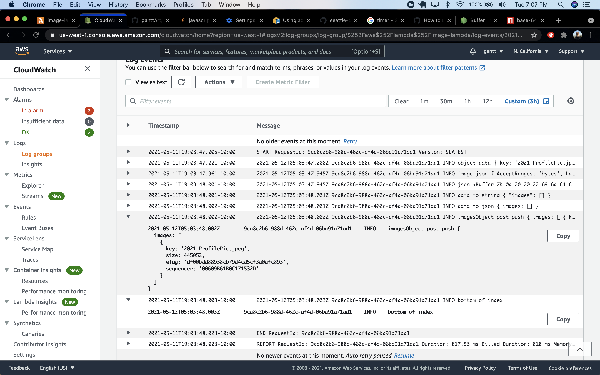

# image-lambda

Project Notes:

- Currently the lambda function is being called, getting the data from the s3 file upload, getting the images.json from the bucket, turning that information back into json format and adding the file upload information to that json. But overwritting that file back to the s3 bucket has yet to be successful.

---

## a description of how to use your lambda

- The lambda function is called when a new file is added to the associated bucket

## a description of any issues you encountered during deployment of this lambda

- Upload package.json and node_modules, not package-lock.json
- Use `zip -r server.zip *` to zip

## a link to your images.json file

- https://cf401-image-lambda.s3-us-west-1.amazonaws.com/images.json
